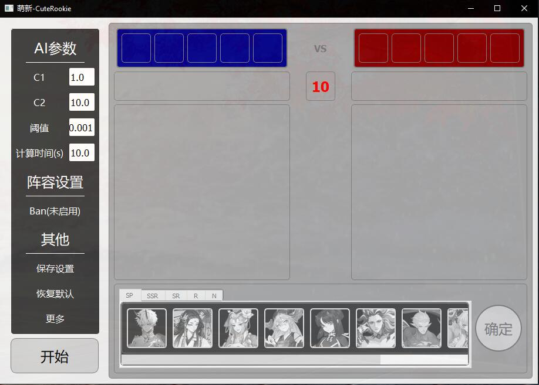

# CuteRookie4User
 阴阳师翻牌AI“萌新”。

主页： [https://yysrank.ahrisy.com/ai](https://yysrank.ahrisy.com/ai)

## Introduction

萌新（CuteRookie）是模拟斗技翻牌的人工智能，主要用到了MCTS与深度学习的相关技术，训练集来自最近四周的各服前100名阴阳师的斗技对战记录。

模型每周一下午6点前更新，推荐使用GitHub clone下来，以省去手动更新的烦琐。

下载Python脚本的话请安装下面提到的包。

下载exe版见右侧release，无需安装。之后每周更新后除非特别说明，否则只需要下载model文件夹和config.json文件，并替换掉原来的文件即可。

百度网盘链接：


## Requirements

* python >= 3.6， 官网：[https://www.python.org/](https://www.python.org/)
* PyQt5, 安装方法：`pip install PyQt5`
* TensorFlow >= 2.0（无需GPU版本），官网：[https://tensorflow.google.cn/](https://tensorflow.google.cn/)，安装方法： `pip install tensorflow`

### PS:

Tensorflow文件很大，在国内的话可能会因为网络问题下到一半网就断了。所以推荐国内的阴阳师大人们使用国内镜像源，使用方法：

```
pip install tensorflow -i 镜像源 
```

国内镜像源：

* 阿里云： https://mirrors.aliyun.com/pypi/simple/
* 中国科学技术大学（母校嘤嘤嘤）： https://pypi.mirrors.ustc.edu.cn/simple/
* 豆瓣： https://pypi.douban.com/simple/
* 清华大学： https://pypi.tuna.tsinghua.edu.cn/simple/

PyQt5也可以用相同方法从国内镜像下载。

## Quick Start

下载完成后，在程序目录下，命令行输入 `python start.py` 即可。

首次运行时请联网，程序会自动下载所需的式神立绘与图标。



### 参数说明

* C1：值越大，MCTS越倾向于广度；值越小，越倾向于深度。
* C2：值越大，先验概率的影响越大。
* 阈值：先验概率低于该阈值的分支将不进行搜索。
* 计算时间：AI用于计算的时间。
* Ban（按钮）：点击可选择一些式神，被选中的式神将会被Ban掉。

## Implementation

参考了AlphaGo的原理，但考虑到普通计算机计算性能的原因做了很大的简化。

训练了两个神经网络RewardNet和PredictNet，RewardNet用来预测阵容的胜率，并将此作为MCTS最后用来更新节点的reward。PredictNet则是预测下一手的pick，用来做MCTS的playout以及先验概率。

为了减轻计算负担，先验概率小于阈值的分支将不予考虑。

RewardNet和PredictNet都是设计了特定结构的Dense层，以减轻计算量。（本来是考虑用RNN的，比如GRU啥的，但推理速度实在是太TM慢了，完全不适合在MCTS这种需要大规模重复试验的情况。）

对MCTS的UCB也做了一些修改，使得先验概率的影响会随着试验次数的增多而递减趋于0，这样使得MCTS在早期能尽快找到一个可以接受的结果，但不会被困住局部最优中。

目前RewardNet在测试集上的准确率可以达到61%以上，PredictNet在测试集上的准确率在35%以上，top5准确率则达到近80%，均达到可以使用的水平。（PS，dota的胜率预测模型最高准确率在63%左右）

在本人的电脑上可以在10s内进行700-800次搜索。